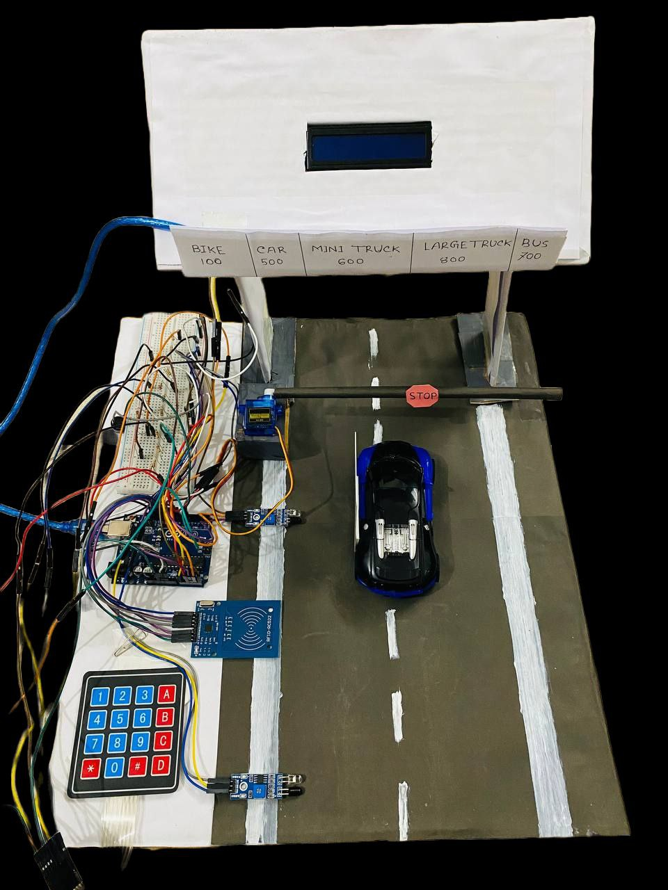
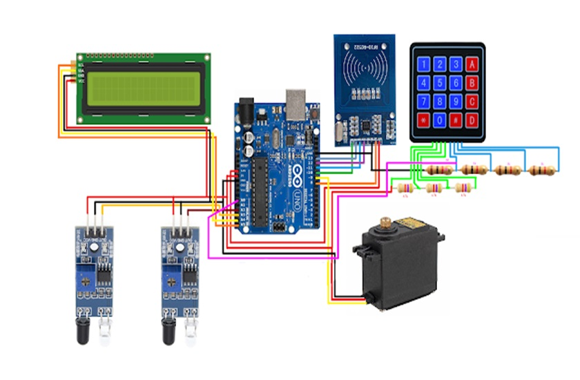

# Automated Toll Collection System using Arduino

An Arduino-based automatic toll collection prototype that uses RFID card authentication, IR sensors, a servo-controlled gate, keypad-based recharge, buzzer alerts, and an LCD display to simulate a smart toll booth system.

## Project Overview

This project is designed to reduce manual toll booth work by automating vehicle detection, card verification, payment deduction, and gate control. When a vehicle reaches the toll point, the system asks the user to scan an RFID card. If the card is valid and has enough balance, the toll amount is deducted and the gate opens. If the balance is insufficient or the card is unknown, the system denies access and shows the proper message on the LCD.

## Features

- RFID-based vehicle/user identification
- Automatic toll deduction from stored card balance
- Servo motor controlled toll gate
- IR sensor-based vehicle detection
- LCD display for user instructions and balance status
- Buzzer alert for success and invalid access
- Keypad-based recharge mode
- Simple Arduino implementation for academic/demo projects

## How the System Works

1. The first IR sensor detects a vehicle near the toll booth.
2. The LCD asks the user to place an RFID card on the reader.
3. The RFID module checks the card UID.
4. If the card is valid and the balance is enough, the system deducts the toll amount.
5. The servo motor opens the gate.
6. After the vehicle passes the second sensor, the gate closes again.
7. If the balance is low, the user can enter recharge mode using the keypad.

## Hardware Components

| Component | Purpose |
|---|---|
| Arduino Uno/Nano | Main controller |
| MFRC522 RFID Module | Reads RFID card/tag |
| RFID Card/Tag | User/vehicle identification |
| Servo Motor | Opens and closes the gate |
| IR Sensors | Detect vehicle entry and exit |
| 16x2 I2C LCD | Shows system messages |
| 4x4 Keypad | Enters recharge amount |
| Buzzer | Alerts for success/error |
| Jumper Wires & Breadboard | Circuit connection |

## Pin Configuration

| Device | Arduino Pin |
|---|---|
| RFID SS/SDA | D10 |
| RFID RST | D8 |
| Servo Motor | D9 |
| Buzzer | D6 |
| IR Sensor 1 | A2 |
| IR Sensor 2 | A3 |
| Keypad Analog Input | A0 |
| I2C LCD | SDA/SCL |

## Project Images

### Final Prototype

### Circuit Diagram

## Repository Contents

| File/Folder | Description |
|---|---|
| `Code/ Arduino-Based-Toll-Collection-System-main` | Arduino source code |
| `Final.jpg` | Final project/prototype image |
| `circuit_diagram.jpg` | Circuit diagram image |
| `Project_Report.pdf` | Full project report |
| `final_presentation_micro.pptx` | Project presentation file |
| `video_20240131_234450_edit.mp4` | Project demonstration video |

## Required Arduino Libraries

Install these libraries in the Arduino IDE before uploading the code:

- `SPI`
- `MFRC522`
- `OnewireKeypad`
- `Servo`
- `LiquidCrystal_I2C`

## Setup Instructions

1. Open the project code folder.
2. Open the Arduino sketch in Arduino IDE.
3. Install the required libraries from **Sketch > Include Library > Manage Libraries**.
4. Connect the hardware according to the circuit diagram.
5. Select the correct board from **Tools > Board**.
6. Select the correct port from **Tools > Port**.
7. Upload the code to the Arduino board.
8. Power the circuit and test the RFID card, sensors, keypad, LCD, buzzer, and servo gate.

## Default System Values

| Item | Value |
|---|---|
| Default Card UID | `E3 E7 58 17` |
| Initial Balance | `2000 Tk` |
| Toll Amount | `500 Tk` |
| Recharge Mode Key | `A` |
| Confirm Recharge Key | `B` |

## Recharge Process

1. Press `A` on the keypad to enter recharge mode.
2. Enter the recharge amount using the keypad.
3. Press `B` to confirm the recharge.
4. The LCD will show the updated balance.

## Output Messages

The LCD shows messages such as:

- `Vehicle detected`
- `Put your card to the reader`
- `Successfully paid your bill`
- `Your Remaining balance`
- `Your balance is insufficient`
- `Please Recharge`
- `Unknown Vehicle Access denied`
- `Have a safe journey`

## Future Improvements

- Store card balance permanently using EEPROM or a database
- Add multiple RFID cards/users
- Add real-time toll logs
- Add Wi-Fi/IoT support using ESP8266 or ESP32
- Add web dashboard for monitoring toll transactions
- Add automatic receipt generation

## Author

**Mostafiz Fahim**  
GitHub: [MostafizFahim](https://github.com/MostafizFahim)

## License

This project is for academic and learning purposes. You can modify and improve it based on your requirements.
